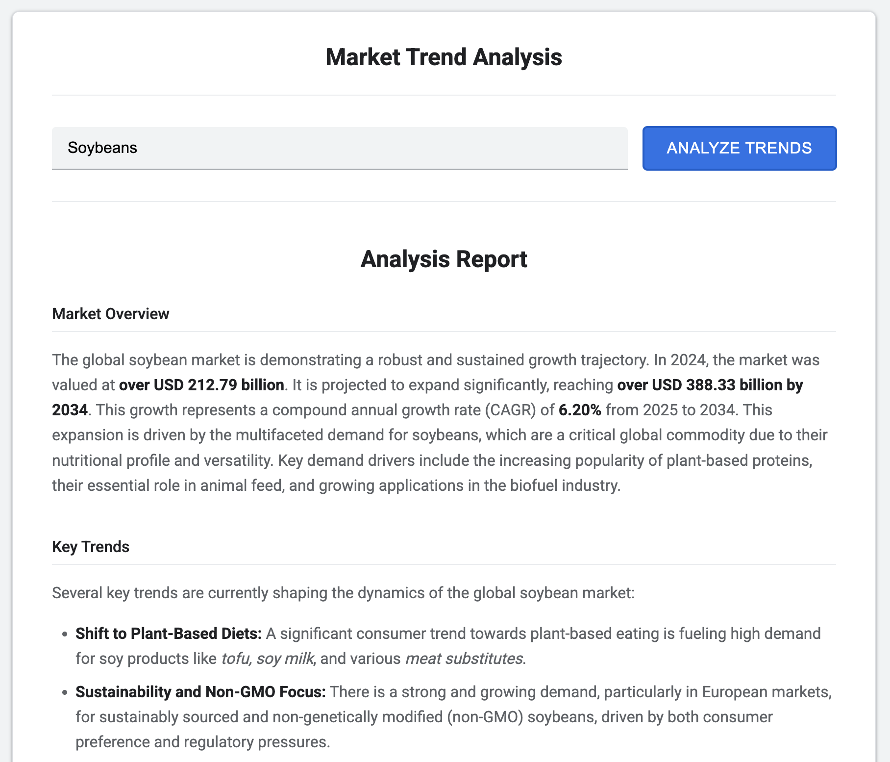
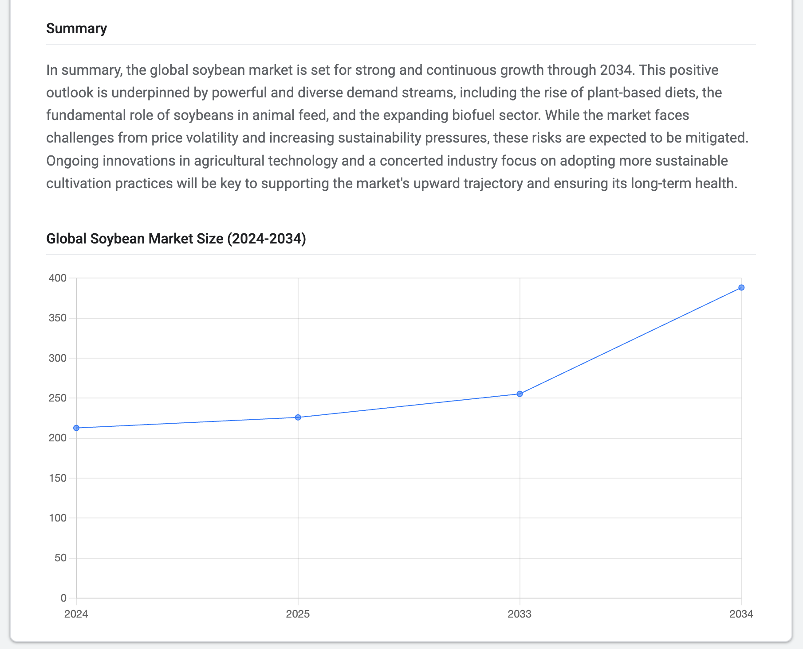

# Gemini Market Analysis Report Generator

This is a sample web application that demonstrates how to use the Google Gemini API's native Google Search tool for two distinct purposes:
1.  **Data Collection**: Actively searching the web to gather information for a comprehensive report.
2.  **Response Grounding**: Ensuring the model's final, structured output is factually consistent and up-to-date.


...


## Features

- **AI-Powered Research**: Uses Gemini with the Google Search tool for up-to-date information gathering.
- **Structured Reports**: Automatically generates reports with sections like Market Overview, Key Trends, and Competitive Landscape.
- **Dynamic Charting**: Creates charts (bar, line, doughnut, etc.) to visualize key data points.
- **Markdown Support**: Renders rich text formatting (bold, lists, etc.) in reports for better readability.
- **Modern UI**: Clean, responsive interface styled to resemble Google's Material Design.

## Tech Stack

- **Backend**: Python, Flask, Google Generative AI SDK
- **Frontend**: HTML, CSS, JavaScript
- **Libraries**: Chart.js (for charts), Marked.js (for Markdown)

---

## Setup and Installation

Follow these steps to get the application running locally.

### Prerequisites

- Python 3.8+
- A Google API key with the Gemini API enabled. You can get one from the [Google AI Studio](https://aistudio.google.com/app/apikey).

### Installation

1.  **Clone the repository:**
    ```bash
    git clone https://github.com/andreenko-repo/gemini_market_analysis.git
    cd gemini_market_analysis
    ```

2.  **Create and activate a virtual environment:**
    ```bash
    # For macOS/Linux
    python3 -m venv venv
    source venv/bin/activate

    # For Windows
    python -m venv venv
    venv\Scripts\activate
    ```

3.  **Install the dependencies:**
    ```bash
    pip install -r requirements.txt
    ```

4.  **Set up your environment variables:**
    Create a file named `.env` in the root directory of the project and add your Google API key to it:
    ```
    GOOGLE_API_KEY='YOUR_API_KEY_HERE'
    ```

---

## Running the Application

1.  **Start the Flask server:**
    ```bash
    python3 app.py
    ```

2.  **Open the application in your browser:**
    Navigate to `http://127.0.0.1:5001`.

---

## How It Works

The application uses a two-step process to generate reports, showcasing different uses of the Google Search tool.

1.  **Data Collection Step**: A prompt is sent to the Gemini model with the Google Search tool enabled for broad data collection. The model actively searches the web to gather comprehensive information on the user's topic and returns it as an unstructured text block.

2.  **Structuring & Grounding Step**: The text from the first step is sent to a second model call. This model is instructed to parse the text and structure it into a specific JSON format. The Google Search tool is used here for **grounding**, ensuring the final structured output is factually consistent and up-to-date before being sent to the frontend.

## Project Structure

```
├── app.py                  # Main Flask application, handles API calls
├── requirements.txt        # Python dependencies
├── .env                    # For storing API keys (not committed)
├── static/
│   └── styles.css          # CSS for styling the application
└── templates/
    └── index.html          # Main HTML template for the UI
```

## License

This project is licensed under the MIT License.